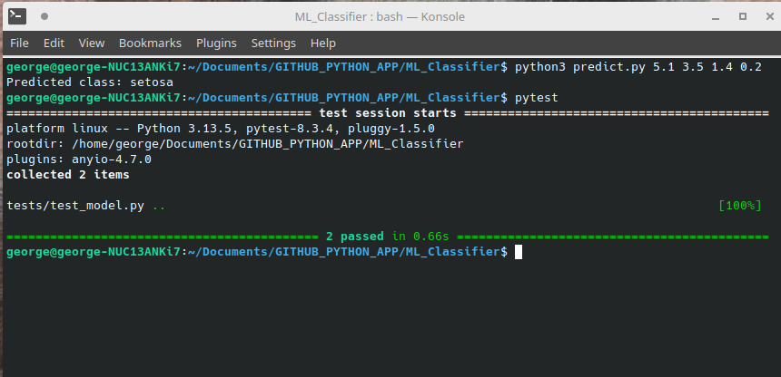

# Iris Classifier with Pytest

This is a simple Machine Learning project using scikit-learn's Iris dataset.

It trains a RandomForestClassifier, saves the model, and provides a script for predictions.
Pytest is used to validate that the model is working correctly.

## Installation

pip install -r requirements.txt

## Training the model

python3 train.py

## Making predictions

python3 predict.py 5.1 3.5 1.4 0.2

## Running tests

pytest

